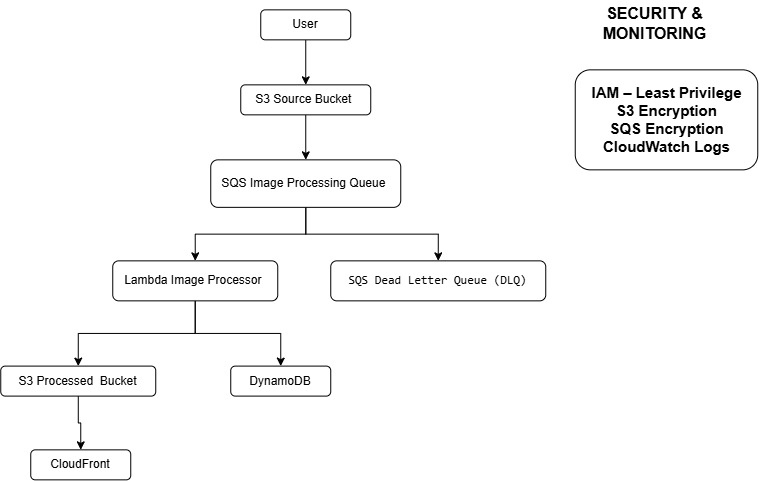

\# AWS Serverless Image Processing Pipeline


\## AWS Solutions Architect Associate Graduation Project


This project implements a serverless, event-driven image processing pipeline on AWS.


The infrastructure is completely deployed using Terraform Infrastructure as Code (IaC).


\---


<<<<<<< HEAD
\## Architecture
=======
>>>>>>> e9412c6 (Add architecture diagram to README)
## Solution Architecture

The following diagram illustrates the complete AWS solution architecture:



### Architecture Workflow

The workflow is:

User → S3 Source Bucket → SQS → Lambda → S3 Processed Bucket

Lambda also stores image metadata in DynamoDB, while CloudFront provides delivery of processed images.
\---


\## AWS Services


The project uses the following AWS services:


\- Amazon S3

\- Amazon SQS

\- AWS Lambda

\- Amazon DynamoDB

\- Amazon CloudFront

\- Amazon CloudWatch

\- AWS IAM


\---


\## Project Objectives


The main objectives are:


\- Build an event-driven serverless architecture.

\- Process uploaded objects asynchronously.

\- Decouple image uploads from image processing.

\- Store processed images in Amazon S3.

\- Store image metadata in DynamoDB.

\- Deliver processed images using CloudFront.

\- Implement a Dead Letter Queue for failed processing.

\- Apply AWS security best practices.

\- Deploy the entire infrastructure using Terraform.


\---


\## Architecture Components


\### 1. Amazon S3 Source Bucket


The source bucket receives uploaded images.


S3 ObjectCreated events trigger messages to the SQS queue.


The bucket has:


\- Versioning enabled

\- Server-side encryption

\- Block Public Access enabled

\- Lifecycle configuration


\---


\### 2. Amazon SQS


Amazon SQS provides asynchronous communication between S3 and Lambda.


This provides:


\- Decoupling

\- Retry capability

\- Message durability

\- Improved resilience


\---


\### 3. Dead Letter Queue


Messages that fail processing multiple times are moved to the Dead Letter Queue.


The configured maximum receive count is:


3


This prevents continuously failing messages from blocking the processing queue.


\---


\### 4. AWS Lambda


Lambda consumes messages from SQS.


The Lambda function:


1\. Receives the S3 event.

2\. Reads the source object information.

3\. Copies the object to the processed bucket.

4\. Adds processing metadata.

5\. Stores processing information in DynamoDB.


\---


\### 5. Amazon S3 Processed Bucket


Processed objects are stored in a separate S3 bucket.


The bucket is private.


Public access is blocked.


CloudFront accesses the bucket using Origin Access Control.


\---


\### 6. Amazon DynamoDB


DynamoDB stores image metadata including:


\- Image ID

\- Source bucket

\- Source key

\- Processed bucket

\- Processed key

\- Processing status

\- Processing timestamp


\---


\### 7. Amazon CloudFront


CloudFront provides global delivery of processed images.


The processed S3 bucket remains private.


CloudFront uses Origin Access Control to securely access the S3 bucket.


HTTPS is enabled using the default CloudFront certificate.


\---


\### 8. IAM


IAM permissions follow the principle of least privilege.


The Lambda role is granted only the permissions required to:


\- Read objects from the source bucket

\- Write objects to the processed bucket

\- Write metadata to DynamoDB

\- Consume messages from SQS

\- Write logs to CloudWatch


\---


\### 9. CloudWatch


CloudWatch Logs are used to monitor Lambda execution.


Lambda logs include:


\- Received events

\- Processing information

\- Successful processing

\- Errors


\---


\# Infrastructure as Code


The entire AWS infrastructure is managed using Terraform.


Terraform is used to create:


\- S3 buckets

\- SQS queues

\- SQS Dead Letter Queue

\- Lambda function

\- IAM roles and policies

\- DynamoDB table

\- CloudWatch log group

\- CloudFront distribution


\---


\# Deployment


\## Initialize Terraform


```bash

terraform init

